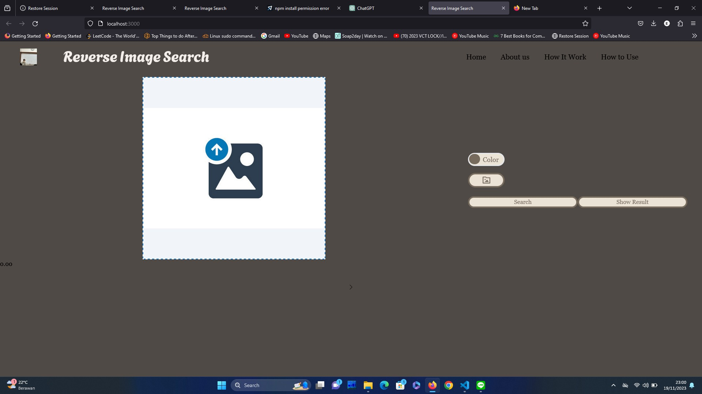

# Algeo02-22037

> Image Retrieval System berbasis website menggunakan CBIR dengan parameter warna dan CBIR dengan parameter tekstur

## Table of Contents

- [General Info](#general-information)
- [Features](#features)
- [Screenshots](#screenshots)
- [Usage](#usage)
- [Programming Language Used](#programming-language-used)
<!-- * [Contact](#contact) -->

## General Information

- Kami menggunakan React.js dan Express.js dalam mengembangkan website ini
- Untuk algoritma pengolahan pencocokan gambar dilakukan dengan program python di _server side_
- Dalam menjalankan algoritmanya kita perlu menggunakan data set yang cukup banyak
- Algoritma _image retrieval system_ yang kami gunakan adalah _Content-Based Image Retrieval_

We made a face recognition using eigenface algorithm.
The contributors of this project are:

- 13522037 Farhan Nafis Rayhan
- 13522079 Emery Fathan Zwageri
- 13522120 Muhamad Rifki Virziadeili Harisman

## Features

List the ready features here:

- CBIR dengan parameter warna
- CBIR dengan parameter tekstur

## Screenshots



## Usage

- Klik foto dummy untuk insert image
- Masukkan dataset
- Klik search
- Lalu tampilkan hasil

## Run Program

> Install dependencies

- "axios": "^1.6.2",
- "child_process": "^1.0.2",
- "cors": "^2.8.5",
- "express": "^4.18.2",
- "fs-extra": "^11.1.1",
- "multer": "^1.4.5-lts.1",
- "react": "^18.2.0"
- "concurrently": "^8.2.2",
- "eslint-plugin-react": "^7.33.2",
- "eslint-plugin-react-hooks": "^4.6.0",
- "nodemon": "^3.0.1",
- "tailwindcss": "^3.3.5"

```
npm start
```

```
Buka http://localhost:3000 pada browser anda
```

## Programming Language Used

- Python
- JavaScript
- HTML
- CSS
